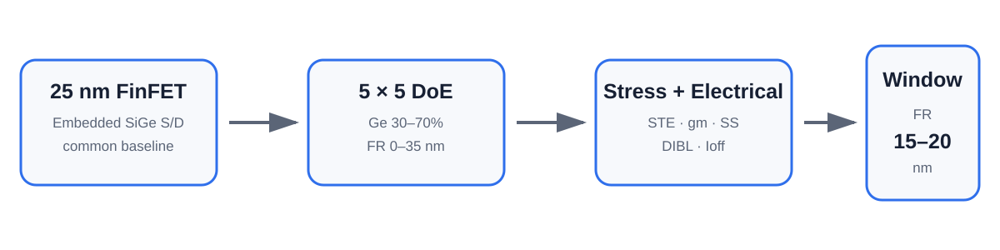

# FinFET pMOS Embedded SiGe S/D Stress Engineering

2026년 8–9월 차세대반도체 경진대회를 위해 수행한 **FinFET pMOS Embedded SiGe Source/Drain 응력공학 프로젝트**입니다.

25 nm FinFET pMOS에서 **Ge 조성(30–70%) × Source/Drain fin recess depth, FR(0–35 nm)**를 5×5로 조합한 25개 TCAD 조건을 비교해, 채널 압축응력·Stress Transfer Efficiency(STE)·구동 성능·정전제어·누설의 trade-off를 분석했습니다.

프로젝트의 최종 결론은 **응력 자체를 최대화하는 조건보다, 응력 전달 이득이 포화되기 전에 전기적 손실을 억제하는 FR 15–20 nm 구간이 실용적인 설계창**이라는 것입니다.

---

## Results at a Glance

| Item | Result |
|---|---:|
| Device | 25 nm FinFET pMOS |
| Embedded S/D | SiGe |
| Main DoE | Ge 30/40/50/60/70% × FR 0/10/20/30/35 nm |
| Main grid | 25/25 completed |
| My TCAD runs | Ge 30%, 40% × 5 FR = **10 core runs** |
| Final STE numerator | ChFin volume-averaged longitudinal stress |
| Practical FR window | **15–20 nm** |
| Ge=50%, FR=20 nm STE | 0.667 |
| Ge=50%, FR=20 nm gmSat | 1.149e-4 S/µm |
| Ge=50%, FR=20 nm Ioff_norm | 9.68e-10 |
| FR 20→22 nm | STE almost saturated while Ioff roughly doubled |

---

## Why This Project Matters

Embedded SiGe S/D can increase compressive stress in a pMOS channel and improve drive performance. However, **more stress is not automatically a better device**.

This project separated three questions:

1. How much absolute channel stress is generated?
2. How efficiently is the nominal SiGe stress transferred into the Fin channel?
3. At what point does deeper S/D recess begin to cost too much in SS, DIBL, and leakage?

This led to a 2-D design-space analysis rather than a single-parameter optimization.

---

## My Contribution

I was responsible for the **low-Ge portion of the 5×5 DoE**:

- Ge = 30%, FR = 0 / 10 / 20 / 30 / 35 nm
- Ge = 40%, FR = 0 / 10 / 20 / 30 / 35 nm
- total: **10 core Sentaurus TCAD runs**
- export and organization of stress/electrical metrics
- early Ge-only sweep and SVisual StressZZ comparison for low-Ge conditions
- participation in the common baseline/validation process and final interpretation

The individual raw result subset is preserved in [results/subin_doe.csv](./results/subin_doe.csv).

Team-wide analysis and conclusions are clearly separated from my individual contribution throughout this repository.

---

## Key Findings

### 1. Ge mainly increases absolute stress and drive capability

At FR=0, increasing Ge from 30% to 70% increased channel compressive stress magnitude from **1.346 to 3.210 GPa**. The final team summary reports approximately **+34% IdSat_norm** over this range, while leakage increased by about **5.6×**.

### 2. FR mainly controls stress-transfer efficiency

Across the 25-point grid, STE rises strongly from FR=0 to roughly 20 nm, then changes only slightly at deeper recess.

For Ge=50%:

| FR (nm) | STE | gmSat (S/µm) | SSlin (mV/dec) | Ioff_norm |
|---:|---:|---:|---:|---:|
| 15 | 0.660 | 1.143e-4 | 82.2 | 5.26e-10 |
| 20 | 0.667 | **1.149e-4** | 84.7 | 9.68e-10 |
| 22 | 0.668 | 1.131e-4 | 87.5 | 1.93e-9 |

The additional STE gain from 20→22 nm is extremely small, while gmSat falls and leakage rises sharply.

### 3. The practical FR window is 15–20 nm

The team therefore proposed **FR = 15–20 nm** as the practical design window for this TCAD structure.

### 4. Deep-recess degradation is not explained by strain alone

A Strain_Impact ON/OFF FR sweep showed that SS, DIBL, and leakage degradation remained even when strain-to-electrical coupling was disabled. This supports the interpretation that **recess-induced geometry/electrostatic changes are the primary cause**, with stress/band-structure effects adding further degradation.

---

## Read the Project

| Page | Description |
|---|---|
| [Project Page](./index.html) | 프로젝트 전체 흐름과 핵심 결과 |
| [Detailed Navigation](./guide/00_navigation.md) | 전체 문서 안내 |
| [Project Overview](./guide/01_project_overview.md) | 문제 정의와 최종 연구 질문 |
| [Topic Evolution](./guide/02_topic_evolution.md) | 여러 후보를 기각하고 최종 주제로 전환한 과정 |
| [Baseline & DoE](./guide/03_baseline_and_doe.md) | 25 nm FinFET 기준 구조와 5×5 실험 설계 |
| [STE Definition](./guide/04_ste_definition.md) | Stress Transfer Efficiency 정의와 선택 근거 |
| [My Contribution](./guide/05_my_contribution.md) | 주수빈 담당 TCAD 실행 범위와 데이터 |
| [Team Analysis](./guide/06_team_analysis_pipeline.md) | 팀 결과 병합·검증·분석 흐름 |
| [2-D Results](./guide/07_2d_results.md) | Ge·FR 주효과와 25점 지도 |
| [Design Window](./guide/08_design_window.md) | FR 15–20 nm 도출 근거 |
| [Validation](./guide/09_validation_and_sensitivity.md) | Strain ON/OFF, 재현성, fin-width 민감도 |
| [Limitations](./guide/10_limitations_and_lessons.md) | 적용 범위와 개선점 |
| [References](./references/README.md) | 최종 보고서 사용 문헌 |
| [Source Scope](./source/README.md) | 공개 가능한 코드·자료 범위 |

---

## Results & Evidence

- [results/subin_doe.csv](./results/subin_doe.csv): my 10-run low-Ge DoE subset
- [results/team_doe_grid.csv](./results/team_doe_grid.csv): cleaned 25-point team grid
- [results/ge50_design_window.csv](./results/ge50_design_window.csv): FR design-window refinement
- [results/strain_impact_summary.csv](./results/strain_impact_summary.csv): deep-recess mechanism check

Team source repositories:
- [Share — execution/results repository](https://github.com/ryu980920/Share)
- [competition — final report and project history](https://github.com/ryu980920/competition)

---

## Source Code Scope

The device model originated from the **Synopsys Sentaurus Applications Library FinFET example**. The team intentionally did not redistribute the proprietary example SProcess/SDevice/SVisual source files in the public repository.

This portfolio follows the same rule. It documents the model, parameters, data-processing flow, and results without republishing Synopsys example source code.

See [source/README.md](./source/README.md).

---

## Repository Structure

    TCAD-FinFET-SiGe-Stress-Engineering/
    ├── README.md
    ├── index.html
    ├── index.md
    ├── _config.yml
    ├── assets/
    ├── figures/
    ├── guide/
    ├── results/
    ├── source/
    ├── study/
    ├── references/
    ├── appendix/
    └── report/

---

## Project Scope

This repository is a personal portfolio reconstruction of a three-person team project. Team-level conclusions are identified as such, and individual contribution is limited to work supported by the shared repository records.

The reported design window applies to the simulated FinFET structure and parameter range used in this project; it is not presented as a universal manufacturing rule.
